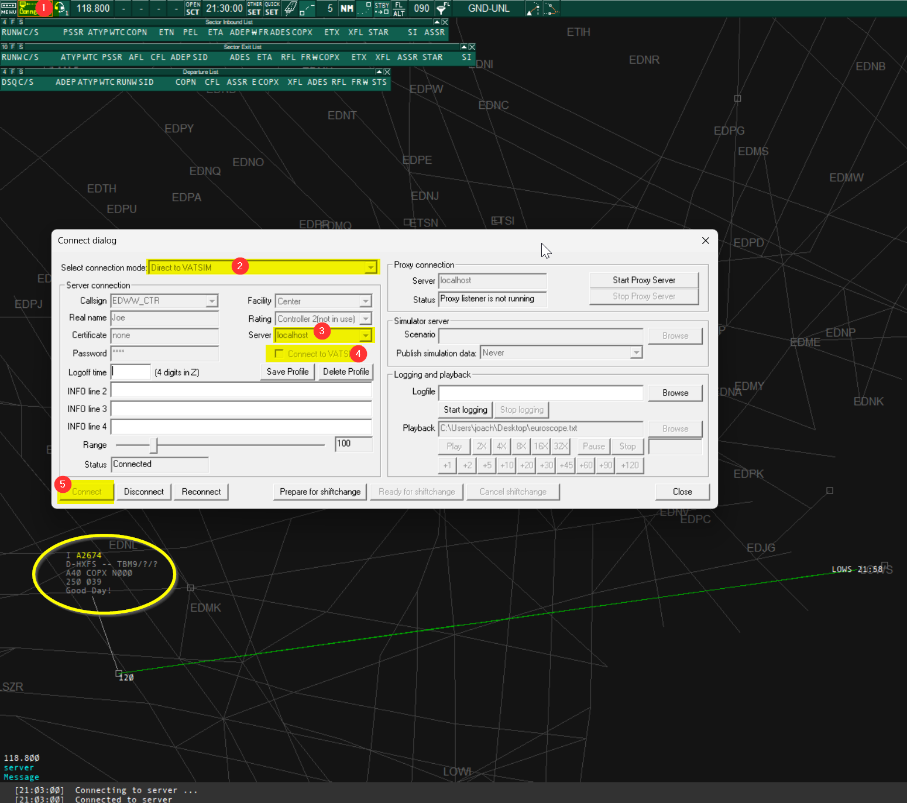

# JoinFS → EuroScope Bridge


Shows live [JoinFS](https://joinfs.net/) traffic in [EuroScope](https://www.euroscope.hu/) as real, interactive aircraft — selectable, tag-clickable, and able to receive text messages — not just symbols drawn on the screen.

It works by connecting to JoinFS's live websocket feed and re-serving that traffic to EuroScope over a local network connection, the same way EuroScope normally receives traffic from an ATC network. Aircraft positions are forwarded as soon as JoinFS reports them (no artificial delay), so the picture stays smooth and current.

## Quick start (end users)

1. Download the latest release zip and extract it. You'll get a `JoinFS-EuroScope-bridge` folder containing:
   - `joinfs-euroscope-bridge.exe`
   - `config.json`
   - this README
2. Open `config.json` in a text editor and fill in your JoinFS websocket details (see [Configuring config.json](#configuring-configjson) below).
3. Double-click `joinfs-euroscope-bridge.exe` to start it. A console window opens and logs its status — leave it running in the background.
4. In EuroScope, open the **Connect dialog** and connect to the bridge (see [Connecting from EuroScope](#connecting-from-euroscope) below).

No Node.js install or command line needed — the `.exe` is fully self-contained.

## Configuring config.json

Start from `config.example.json` if you ever need a clean template — `config.json` is your own editable copy (release zips ship it pre-filled with the example defaults).

| Field | Description |
| --- | --- |
| `joinfsWebSocketUrl` | The `wss://` URL of JoinFS's live traffic feed. Required. |
| `joinfsAuthHeaderName` / `joinfsAuthHeaderValue` | Optional HTTP header sent when connecting to JoinFS, if your feed requires authentication. Leave both blank if not needed. |
| `fsdListenHost` | Address the bridge listens on for EuroScope. Leave as `127.0.0.1` unless you specifically want other machines to connect. |
| `fsdListenPort` | Port the bridge listens on. Defaults to `6809`, which is also EuroScope's default when no port is specified. |
| `updateIntervalMs` | How often JoinFS pushes updates, for reference only — not currently used to throttle anything. |

The bridge always reads `config.json` from the same folder as the `.exe` — edit it and just restart the `.exe`, no rebuild needed.

## Connecting from EuroScope

Open EuroScope's **Connect dialog** and set it up like this:



1. **Select connection mode**: `Direct to VATSIM`
2. **Server**: `localhost` (leave the port blank — it defaults to `6809`, matching the bridge's default)
3. **Callsign / Facility / Rating**: enter your usual controller callsign, facility, and rating as normal
4. **Important — uncheck "Connect to VATSIM"**. This is the one setting that matters most: the bridge identifies itself as a non-VATSIM server, and EuroScope will immediately reject the connection with *"VATSIM server found while non-VATSIM server was requested"* if this box is checked.
5. Click **Connect**.

JoinFS traffic should start appearing on the radar within a few seconds, fully selectable with normal tags and flight plan data.

**Note:** the aircraft shown are live positions only — there's no real pilot behind them, so sending one a text message won't get a reply (that's expected, not a bug).

## Troubleshooting

- The `.exe`'s own console window logs connection status for both sides (JoinFS and EuroScope) and writes the same log to `joinfs-euroscope-bridge.log` next to it.
- EuroScope itself doesn't keep a log file — check the message/chat area at the bottom of its radar screen, or **Settings → System messages...**, for anything it reports about the connection.

## For developers

Project layout:

```
src/
  index.js            entry point
  config.js            loads config.json from beside the running exe (or repo root in dev)
  joinfsClient.js       wss:// client for the JoinFS feed
  aircraftStore.js      merges/tracks aircraft state, expires stale ones
  fsdServer.js           TCP server EuroScope connects to
  fsdProtocol.js         packet builders/parsers for the wire format
  logger.js
scripts/
  build-exe.js          bundles + packages a standalone .exe (Node SEA)
  build-release.ps1      full release build: exe + zip for distribution
  render-readme.js      renders README.md to README.html for the release zip
```

Run from source:

```
npm install
npm start
```

Build a standalone `.exe` only (output in `dist/`):

```
npm run build:exe
```

Build a full release zip (output in `release/`):

```
npm run build:release
```

Both build steps bundle `src/` and its npm dependencies into a single file with [esbuild](https://esbuild.github.io/), then package it as a portable `.exe` using Node's built-in [Single Executable Applications](https://nodejs.org/api/single-executable-applications.html) feature — no third-party packager, no installer. 
The release is then placed as zip into the /release folder.

## Contributing

Issues and pull requests are welcome. If you're planning a larger change, please open an issue first to discuss it before investing significant time.

## License

This project is licensed under [CC BY-NC-SA 4.0](https://creativecommons.org/licenses/by-nc-sa/4.0/) (Attribution-NonCommercial-ShareAlike) — see [LICENSE](LICENSE) for details.
